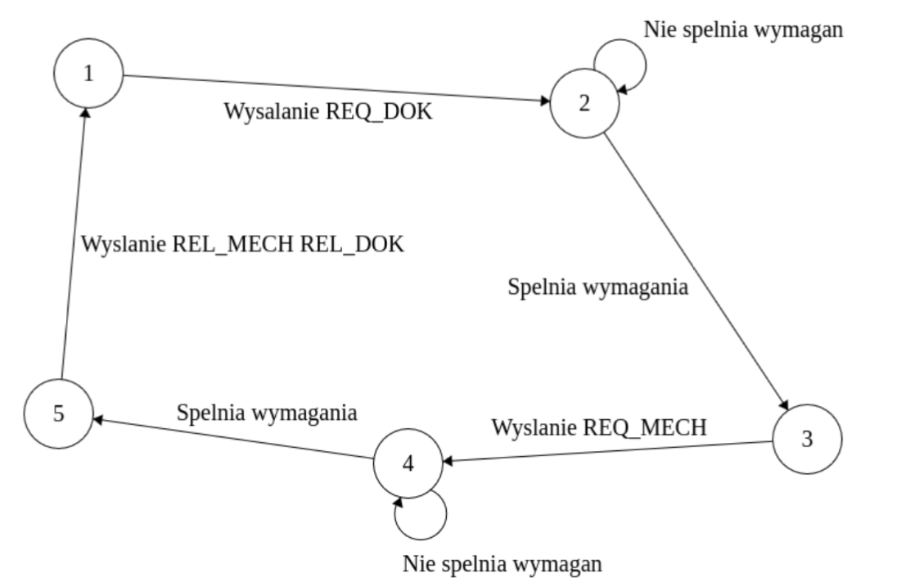
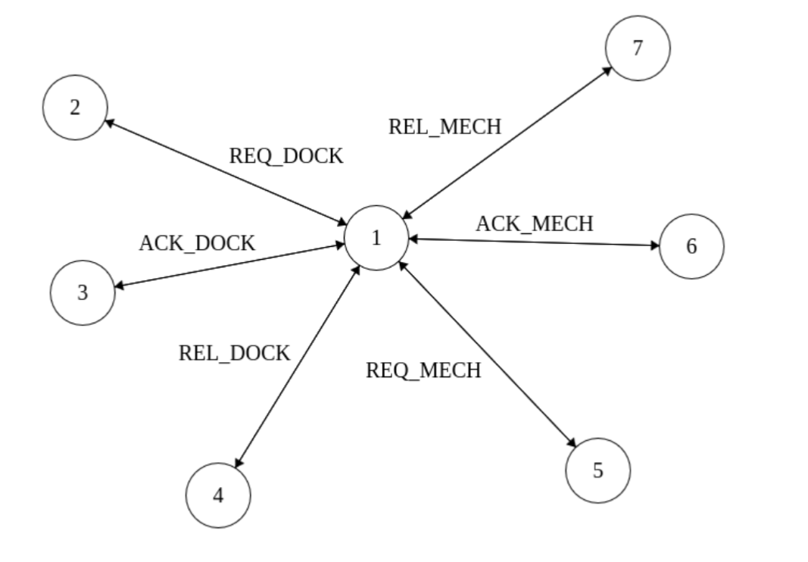

# Wojna z misiami

 ## Autorzy:
    Jakub Szybura 155951 
    Krzysztof Mańczak 155939

**Złożoność komunikacyjna jednej naprawy: 6n, 3n na każdą sekcję krytyczną**

### Pseudokod wątku głównego:
- Sleep(random())
- potrzebni_mechanicy = random<1,M>
- lamport++
- otrzymane_ACK = 0
- send_packet(lamport, 1, tagDokReq, toALL)
- wait_until(otrzymane_ACK >= N && pozycja_w_kolejce_dok < K)
- printf(„Using Dock\n”);
- lamport++
- otrzymane_ACK = 0
-send_packet(lamport, potrzebni_mechanicy, tagMechReq, toALL)
- wait_until(otrzymane_ACK >= N && aktualnie_zajeci_mechanicy + potrzebni_mechanicy <= M)
- printf(„Using mechanics\n”);
- potrzebni_mechanicy = 0
- Sleep(random())
- printf(„Repair done – mechanics unlocked\n”);
- lamport++
- send_packet(lamport, potrzebni_mechanicy, tagMechRel, toALL);
- printf(„Leaving dock – dock unlocked”);
- lamport++
- send_packet(lamport, 1, tagDokRel, toALL);

### Pseudokod wątku komunikacyjnego:
- MPI_Recv(&recvLamport, &recvValue, ANY_SOURCE, ANY_TAG);
- lamport = max(recvLamport, lamport)+1;
- switch(MPI.TAG):
    - case tagDokReq:
        - wstaw_do_kolejki_dok(recvLamport, MPI.ID)
        - send_packet(lamport, 1, tagDokAck, MPI.ID)
    - case tagDokAck:
        - otrzymane_ACK++
    - case tagDokRel:
        - usun_z_kolejki_dok(MPI.ID)
    - case tagMechReq:
        - wstaw_do_kolejki_mech(recvLamport, potrzebni_mechanicy, MPI.ID)
        - send_packet(lamport, 1, tagMechAck, MPI.ID)
    - case tagMechAck:
        - otrzymane_ACK++
    - case tagMechRel:
        - usun_z_kolejki_mech(MPI.ID)

## Maszyna stanów
### Wątek Główny:

Stan 1
- Symulacja walki (sleep)
- Przygotowanie wiadomości
- Broadcast żądania

Stan 2
- Oczekiwanie na dostęp do doku

Stan 3
- Przygotowanie wiadomości żądania mechaników
- Broadcast wiadomości

Stan 4
- Oczekiwanie na dostęp do mechaników

Stan 5
- Symulacja naprawy
- Zwolnienie zasobów

### Wątek Komunikacyjny:
Stan 1
- Otrzymanie Wiadomości
- porównanie zegarów
- zwiększenie zagara

Stan 2
- dodawanie żądania do kolejki doków
- odesłanie potwierdzenia do nadawcy

Stan 3
- zwiększenie licznika potwierdzeń doków

Stan 4
- Usunięcie zwalnianego żądania doków

Stan 5
- dodawanie żądania do kolejki mechaników
- odesłanie potwierdzenia do nadawcy

Stan 6
- zwiększenie licznika potwierdzeń mechaników

Stan 7
- Usunięcie zwalnianego żądania mechaników

